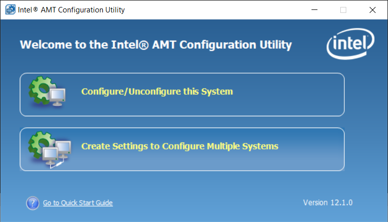
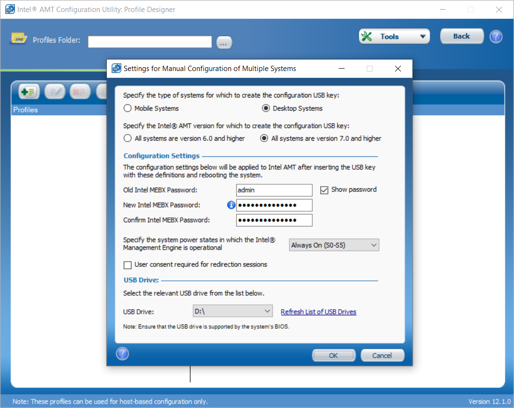
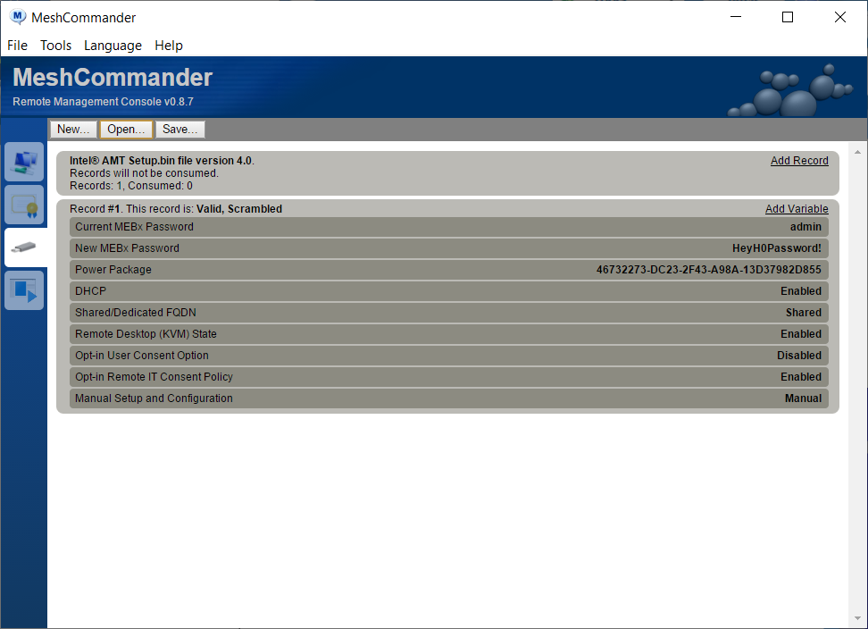
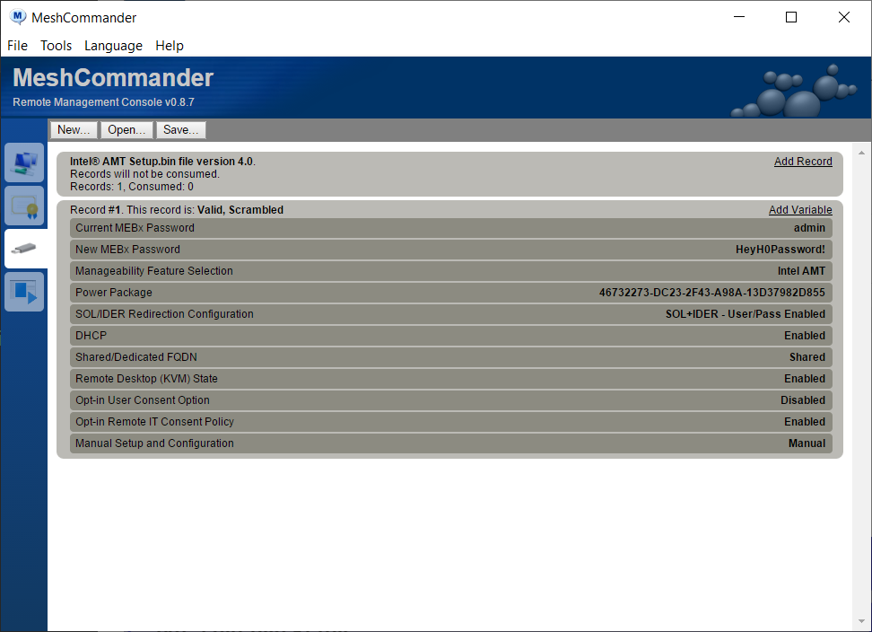
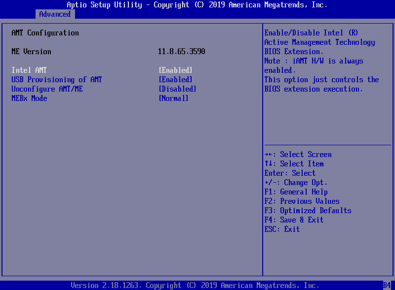
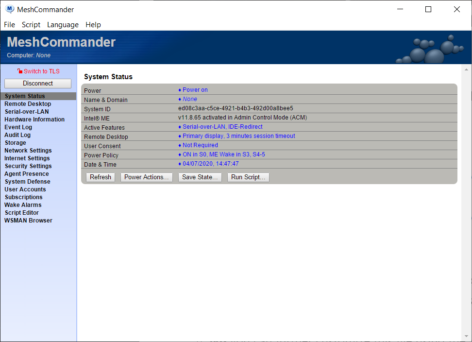

# About

Notes about [Intel AMT](https://en.wikipedia.org/wiki/Intel_Active_Management_Technology) (aka iAMT, aka Active Management Technology).

## Setup

Run the AMT Configuration Utility as Administrator, click the `Create Settings to Configure Multiple Systems` button:

Click the `Tools` button, then select the `Prepare a USB Key for Manual Configuration...` tool:

This should create the `Setup.bin` (saved in this repo as [Setup-default.bin](Setup-default.bin)) file in the USB drive.

Start MeshCommander, then open the `Setup.bin` file using the `Setup.bin Manager` tab:

Using the `Add Variable` link add the following variables:

| Variable | Value |
|----------|-------|
| `Manageability Feature Selection` | `Intel AMT` |
| `SOL/IDER Redirection Configuration` | `SOL+IDER - User/Pass Enabled` |

The end result should be:

Save the result to the `Setup.bin` file (saved in this repo as [Setup.bin](Setup.bin)) inside the USB drive.

Enter the system BIOS, enable `Intel AMT` and `USB Provisioning of AMT`:

Insert the USB drive into the system, save the BIOS settings and reboot the system. At the next boot, the system should ask you to provision AMT from USB. After provisioning you should see something alike:

Add the computer to MeshCommander and connect to it. You should see something alike:

You should now have a basic AMT working. Go ahead and explore it!

## Tools

* https://www.meshcommander.com/
  Open-source tool for managing AMT enabled systems from Linux.
  The source code is at:
  * https://github.com/Ylianst/MeshCommander
  * https://github.com/Ylianst/MeshCentral
* https://www.meshcommander.com/meshcommander/firmware
  This can replace the UI of AMT with MeshCommander.
* https://www.meshcommander.com/meshcommander/meshcmd
  meshcmd can configure amt from the command line.
* Intel Setup and Configuration Software (Intel SCS)
  * it can put a Setup.bin inside a USB pen to automatically configure hosts in Admin Control Mode (ACM).
    * essentially, when the to-be controlled host boots, AMT detects the Setup.bin file
      inside the USB pen and asks the user to apply its settings.
    * **NB** you can further customize this file using the `Setup.bin Manager` tab of MeshCommander.
    * **NB** for this provision method to work you must enable it in the UEFI firmware.
  * https://downloadcenter.intel.com/download/26505/Intel-Setup-and-Configuration-Software-Intel-SCS- 
  * https://downloadmirror.intel.com/26505/eng/Configurator_download_package_12.1.0.87.zip
    * Version: 12.1 (Latest) Date: 4/10/2019
    * **NB** this is the last version that I known that lets you create a `Setup.bin` file using the `Prepare a USB Key for Manual Configuration...` tool window.
    * **NB** I've added a [copy of ACUWizardInstaller-12.1.0.87.msi into this repository](ACUWizardInstaller-12.1.0.87.msi).
    * **NB** you might need to disable the malware/anti-virus protection for
             being able to actually create the pen like the SCS tool wants.

## Documentation

* [Intel vPro Platforms/Intel Active Management Technology (Intel AMT) Lab Setup Guide Video](https://www.intel.com/content/www/us/en/support/articles/000026592/technologies.html)
* [Intel AMT Implementation and Reference Guide](https://software.intel.com/sites/manageability/AMT_Implementation_and_Reference_Guide/default.htm)
* [Active Platform Management Demystified](https://www.meshcommander.com/active-management) is an on-line book about AMT.
